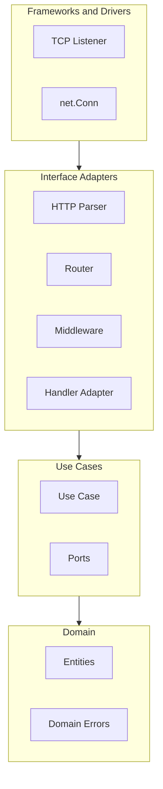

# Web Server Architecture

## 1. System Goals

### 1.1 Primary Objective

To design and implement a custom HTTP/1.1 web server in Go, built directly on top of TCP sockets, without using the `net/http` package for request handling. The purpose is to understand and implement the core mechanics behind modern web frameworks while applying sound software engineering practices.

---

## 1.2 Functional Goals

The system must:

1. Accept TCP connections on a configurable port.
2. Parse HTTP/1.1 requests from raw byte streams.
3. Support routing based on:

   * HTTP method
   * URL path
4. Provide a middleware pipeline for:

   * Logging
   * Request timing
   * Error handling
   * Authentication (future extension)
5. Support concurrent request handling.
6. Provide configurable request timeouts.
7. Support graceful shutdown.
8. Allow structured HTTP responses with:

   * Status code
   * Headers
   * Body
9. Provide static file serving (extension phase).
10. Include structured logging.

---

## 1.3 Non-Functional Goals

### Performance

* Handle multiple concurrent connections efficiently.
* Avoid blocking operations in request handling.
* Prevent resource leaks.

### Scalability

* Use Go’s concurrency model (goroutines).
* Allow future extension to worker pools or connection limits.

### Maintainability

* Clear separation of concerns.
* Modular package structure.
* Small, focused interfaces.
* Unit-testable components.

### Extensibility

* Middleware should be composable.
* Router should allow additional matching strategies.
* Request/Response abstraction should allow future protocol extensions.

### Observability

* Log request lifecycle.
* Log slow requests.
* Log server startup and shutdown events.

---

## 1.4 Engineering Constraints

* No use of `net/http` for request parsing or routing.
* HTTP parsing must be implemented manually.
* Concurrency model must be explicitly defined.
* Code must follow idiomatic Go patterns.
* Use context for timeouts and cancellation.

---

# 2. High-Level Architecture

## 2.1 System Overview

The server operates as a layered pipeline from TCP connection to HTTP response generation, following Clean Architecture principles.

High-level flow:

```
TCP Listener → Connection Acceptor → Connection Handler
    → Request Reader → HTTP Parser (adapter)
    → Handler Adapter (HTTP → Use Case input)
    → Use Case (business logic)
    → Handler Adapter (Use Case output → HTTP)
    → Response Writer → Connection Close / Keep-Alive
```

---

### 2.1.1 Clean Architecture Layers

The system is organized into concentric layers. The **dependency rule** states that dependencies point inward: inner layers know nothing of outer layers.

* **Domain (innermost)**: Entities, domain errors; no dependencies on outer layers.
* **Use Cases**: Application business rules, ports (interfaces); depends only on domain.
* **Interface Adapters**: HTTP parser, router, middleware, handler adapters; implements ports.
* **Frameworks & Drivers**: TCP, net.Conn, os.Signal; outermost.



---

## 2.2 Component Breakdown

### 2.2.0 Domain Layer

The domain layer contains enterprise business rules. It has no knowledge of HTTP, TCP, or any transport.

**Entities**:

* Domain objects (minimal for initial version; placeholder for future User, Session, etc.).
* Pure data structures representing core concepts.

**Domain Errors**:

* Transport-agnostic error types (e.g., `ErrNotFound`, `ErrUnauthorized`).
* Adapters map these to HTTP status codes (404, 401, etc.).
* Domain does not reference status codes or HTTP.

**Rule**: Domain has no dependencies on outer layers.

---

### 2.2.1 TCP Listener

Responsibilities:

* Bind to configured port.
* Accept incoming connections.
* Handle accept-level errors.
* Trigger graceful shutdown on signal.

Implementation:

* Use `net.Listen`
* Loop on `Accept()`
* Spawn goroutine per connection

---

### 2.2.2 Connection Handler

Responsibilities:

* Manage lifecycle of a single TCP connection.
* Read raw bytes.
* Apply request-level timeout.
* Close connection when necessary.
* Support Keep-Alive (future enhancement).

Concurrency Model:

* One goroutine per connection.
* Each connection processes requests sequentially.
* Timeout enforced via context.

---

### 2.2.3 HTTP Parser

Responsibilities:

* Parse request line (METHOD PATH VERSION).
* Parse headers.
* Parse body (based on Content-Length).
* Detect malformed requests.
* Return structured Request object.

Request Structure:

```go
type Request struct {
    Method  string
    Path    string
    Version string
    Headers map[string]string
    Body    []byte
}
```

Parser must:

* Validate HTTP/1.1 format.
* Handle incomplete reads.
* Fail gracefully on malformed input.

---

### 2.2.4 Context Objects

Two distinct context types serve different layers:

**Request Context (application-scoped)**:

* `context.Context` with timeout and cancellation.
* Request ID, user/session metadata (when applicable).
* Passed to use cases; transport-agnostic.

**HTTP Context (adapter-scoped)**:

* Used only within the HTTP adapter layer.
* Contains parsed `Request`, `Response`, `Conn`.
* Never passed to use cases.
* Handler adapters translate between HTTP context and use case input/output.

Handlers (use case adapters) do not expose `net.Conn` to business logic.

---

### 2.2.5 Use Case Layer

Use cases contain application-specific business rules. They are pure functions of their inputs and depend only on domain and ports.

**Ports (interfaces)**:

* Defined in the use case layer.
* Examples: `UserRepository`, `Logger`.
* Use cases depend on these interfaces, not concrete implementations.
* Adapters implement ports.

**Use Cases**:

* Accept plain inputs (path, headers, body, IDs).
* Return outputs or domain errors.
* No knowledge of HTTP, status codes, or `net.Conn`.

**Handler interface (transport-agnostic)**:

```go
type Handler interface {
    Handle(ctx context.Context, input RequestInput) (ResponseOutput, error)
}
```

Example use case:

```go
// GetUserUseCase.Execute(ctx, userID) -> (*User, error)
func (uc *GetUserUseCase) Execute(ctx context.Context, userID string) (*User, error) {
    return uc.repo.GetByID(ctx, userID)
}
```

---

### 2.2.6 Router

Part of the Interface Adapters layer. Maps `(method, path)` to use cases via handler adapters.

Responsibilities:

* Map (method + path) → handler adapter (which wraps a use case).
* Perform route lookup.
* Return 404 when route not found.

Design:

```go
type HandlerFunc func(*Context)

type Router struct {
    routes map[string]HandlerFunc
}
```

Route key format:

```
METHOD + ":" + PATH
```

Example:

```
GET:/users
POST:/login
```

Thread Safety:

* Route registration happens before server start.
* Read-only during runtime.

---

### 2.2.7 Middleware System

Middleware must support composition.

Design:

```go
type Middleware func(HandlerFunc) HandlerFunc
```

Execution order:

```
Request →
    Logging →
    Timeout →
    Recovery →
    Handler →
Response
```

Responsibilities:

* Logging middleware
* Panic recovery middleware
* Timeout middleware
* Metrics middleware (future)

Middleware should:

* Be chainable
* Be independent
* Not depend on global state

Middleware is part of Interface Adapters: cross-cutting (logging, recovery, timeout) and transport-specific. Inject dependencies via ports (e.g., `Logger` interface).

---

### 2.2.8 Handler (HTTP Adapter)

Handlers are **HTTP adapters** that bridge the HTTP transport to use cases. They do not contain business logic.

Responsibilities:

1. Parse HTTP request into use case input.
2. Call the use case.
3. Map use case output (or domain errors) to HTTP response.

Business logic lives in use cases, not handlers. The `HandlerFunc func(*Context)` is an adapter implementation detail; the use case layer defines the `Handler` interface.

Example adapter:

```go
func HelloHandlerAdapter(uc *HelloUseCase) HandlerFunc {
    return func(ctx *Context) {
        output, err := uc.Execute(ctx.Ctx, ctx.Request.Path)
        if err != nil {
            ctx.Response.WriteError(err)  // maps domain error to HTTP status
            return
        }
        ctx.Response.WriteString(output.Message)
    }
}
```

---

### 2.2.9 Response Writer

Responsibilities:

* Serialize Response into HTTP format.
* Write headers.
* Write body.
* Respect status codes.
* Enforce write deadlines.

Example output format:

```
HTTP/1.1 200 OK
Content-Length: 11
Content-Type: text/plain

Hello World
```

---

## 2.3 Concurrency Model

### Initial Strategy: Goroutine Per Connection

Design Decision:

* Each accepted TCP connection runs in its own goroutine.
* Within a connection, requests are processed sequentially.
* Use context.WithTimeout for request-level timeouts.

Advantages:

* Simple.
* Idiomatic Go.
* Scales well for moderate load.

Future Enhancements:

* Worker pool model.
* Connection limiting.
* Backpressure strategy.
* Rate limiting middleware.

---

## 2.4 Timeout Strategy

Timeouts will be enforced at:

1. Connection level

   * SetReadDeadline
   * SetWriteDeadline

2. Request level

   * context.WithTimeout
   * Middleware cancellation

Timeout failure must:

* Abort request processing.
* Return appropriate HTTP status (e.g., 408).

---

## 2.5 Graceful Shutdown

On receiving termination signal:

1. Stop accepting new connections.
2. Allow in-flight requests to complete.
3. Cancel requests exceeding shutdown deadline.
4. Close all connections cleanly.
5. Log shutdown completion.

Use:

* os.Signal
* sync.WaitGroup
* context cancellation

---

## 2.6 Future Extension Points

* HTTP/2 support
* Connection keep-alive
* TLS support
* Structured JSON logging
* Request ID tracing
* Static file server
* Rate limiting
* Load testing integration

---

## 2.7 Package Layout

```
light_serve/
├── cmd/server/main.go       # Composition root, dependency injection
├── internal/
│   ├── domain/              # Entities, domain errors
│   ├── usecase/             # Use cases, ports (interfaces)
│   └── adapter/
│       ├── http/            # TCP listener, parser, router, middleware, handler adapters
│       └── persistence/     # Future: DB implementations
└── docs/
```

**Composition root** (`cmd/server/main.go`): Wires adapters, use cases, and domain; uses constructor injection to satisfy ports.

---

# 3. Architectural Principles Applied

* **Dependency rule**: Dependencies point inward; inner layers know nothing of outer layers.
* **Ports and Adapters**: Interfaces defined by use cases; adapters implement them.
* **Testability**: Use cases testable without HTTP, DB, or external services.
* Separation of concerns
* Composition over inheritance
* Explicit dependency management
* Minimal shared state
* Defensive error handling

---

# 4. Out of Scope (Initial Version)

* HTTP/2
* WebSockets
* Chunked transfer encoding
* Reverse proxy capabilities
* Load balancing

---

# 5. Summary

This system is designed to:

* Recreate the core internals of a production web framework.
* Apply concurrency correctly using Go’s goroutines.
* Implement a clean middleware pipeline.
* Enforce timeouts and cancellation.
* Be extensible, testable, and maintainable.

The focus is not just functionality, but engineering discipline.

**Pragmatic note**: For a minimal server, a lightweight approach is acceptable. Extract use cases for non-trivial handlers, define ports for external dependencies, and keep HTTP in the adapter layer. Avoid over-engineering trivial endpoints (e.g., a simple "Hello World" may not need a dedicated use case).
